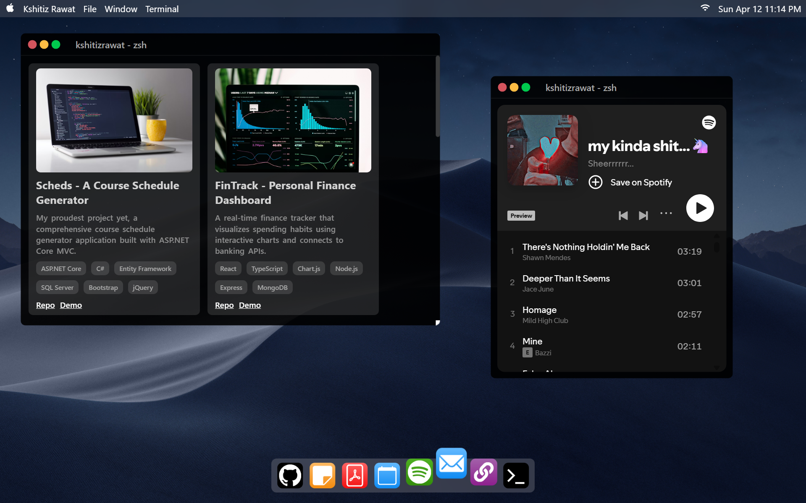
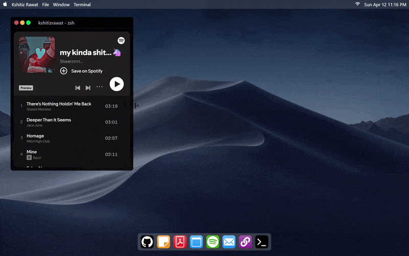

# MacOS Portfolio UI

[](https://react.dev/)
[](https://vite.dev/)
[](#license)
[](#overview)

A desktop-inspired portfolio application built with React and Vite that recreates a macOS-style experience in the browser.

The app uses draggable/resizable windows, a dock launcher, and utility apps (GitHub projects, notes, resume viewer, calendar booking, terminal simulation, Spotify embed, and contact mail composer) to present work in an interactive format.

## Overview

This project is designed as a personal portfolio with a strong UI concept:

- A top navigation bar with live date/time
- A bottom dock that launches individual apps
- Reusable window shell with close controls and drag/resize behavior
- Multiple portfolio-focused mini apps running inside independent windows

## Visual Preview

### Main UI



### Demo GIF



## Core Features

### Desktop Experience

- Draggable + resizable windows powered by `react-rnd`
- Reusable `MacWindow` component for consistent window chrome
- Dock-based app launching from `src/components/Dock.jsx`
- Multi-window state management from `src/App.jsx`

### Built-in Apps

- GitHub Projects: renders project cards from `src/assets/github.json`
- Notes: loads and displays markdown-style text from `public/note.txt`
- Resume: in-app PDF viewer using `react-pdf` and a local PDF worker
- Calendar: embedded Calendly widget for meeting booking
- Spotify: embedded playlist player
- CLI: interactive simulated terminal with predefined commands
- Mail: quick contact form that opens a prefilled `mailto:` draft

### UI and Styling

- Component-level SCSS styles (`*.scss`)
- Vite asset handling through `public/` and `src/assets/`
- Responsive viewport setup in `index.html`

## Tech Stack

- React 19
- Vite 8
- SCSS (Dart Sass)
- ESLint 9

Key libraries:

- `react-rnd` for draggable/resizable windows
- `react-pdf` for resume rendering
- `react-calendly` for scheduling embed
- `react-syntax-highlighter` for notes display
- `moment`, `react-big-calendar`, and additional UI utilities

## Project Structure

```text
MacOS/
|-- public/
|   |-- doc-icons/
|   |-- nav-icons/
|   |-- note.txt
|   `-- resume.pdf
|-- src/
|   |-- assets/
|   |   `-- github.json
|   |-- components/
|   |   |-- Dock.jsx
|   |   |-- Nav.jsx
|   |   |-- DateTime.jsx
|   |   `-- windows/
|   |       |-- MacWindow.jsx
|   |       |-- Github.jsx
|   |       |-- Note.jsx
|   |       |-- Resume.jsx
|   |       |-- Calender.jsx
|   |       |-- Spotify.jsx
|   |       |-- Cli.jsx
|   |       `-- Mail.jsx
|   |-- App.jsx
|   `-- main.jsx
|-- index.html
`-- package.json
```

## Getting Started

### Prerequisites

- Node.js 20+ recommended
- npm 9+

### Installation

```bash
npm install
```

### Run in Development

```bash
npm run dev
```

### Production Build

```bash
npm run build
```

### Preview Build

```bash
npm run preview
```

### Lint

```bash
npm run lint
```

## Customization Guide

- Update portfolio projects in `src/assets/github.json`
- Replace resume file at `public/resume.pdf`
- Edit notes content in `public/note.txt`
- Change dock/nav icons in `public/doc-icons/` and `public/nav-icons/`
- Personalize terminal responses in `src/components/windows/Cli.jsx`
- Update contact destination in `src/components/windows/Mail.jsx`

## Scripts

- `npm run dev`: start Vite dev server
- `npm run build`: create optimized production build
- `npm run preview`: preview the built app locally
- `npm run lint`: run ESLint across the project

## Deployment

### Deploy to Vercel

1. Push this project to GitHub.
2. Go to Vercel and click **Add New Project**.
3. Import the repository.
4. Keep the default framework detection as **Vite**.
5. Confirm the build settings:
	- Build Command: `npm run build`
	- Output Directory: `dist`
	- Install Command: `npm install`
6. Click **Deploy**.

Optional Vercel CLI flow:

```bash
npm i -g vercel
vercel
```

### Deploy to Netlify

1. Push this project to GitHub.
2. In Netlify, click **Add new site** > **Import an existing project**.
3. Connect your Git provider and select the repository.
4. Set build configuration:
	- Build command: `npm run build`
	- Publish directory: `dist`
5. Click **Deploy site**.

Optional Netlify CLI flow:

```bash
npm i -g netlify-cli
netlify deploy
netlify deploy --prod
```

## Known Notes

- Component/file naming currently uses `Calender` (not `Calendar`) for consistency with existing source code.
- The Mail app opens the system default mail client through a `mailto:` link.

## License

This project is for personal/portfolio use. Add a formal license if you plan to distribute it publicly.
